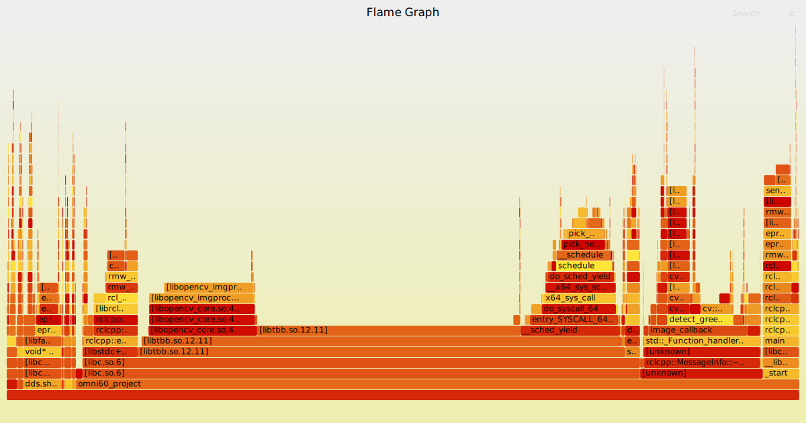

# omni60_project

## Description

This ROS2 package implements early fusion object detection using LiDAR point clouds and camera images from the [Occam Omni60 360 camera](https://docs.clearpathrobotics.com/docs_robots/accessories/sensors/cameras/occam_omni_60/). This package currently looks for all green objects within camera view and matches them to 3D lidar points. The goal of this package is for testing early fusion for plant detection in an agricultural setting. The package was tested using Gazebo Harmonic and ROS2 Jazzy with my [Husky A200 simulator](https://github.com/Moth-Balls/husky_kinova_sim).

## Functionality

1.  **LiDAR Data Subscription:** Subscribes to the `/velodyne_points` topic to receive raw LiDAR point cloud data.
2.  **Image Data Subscription:** Subscribes to five camera image topics (`/camera0/image_raw`, `/camera1/image_raw`, etc.) to receive image data from each camera.
3.  **Object Detection:** Uses OpenCV to detect green objects in each camera image and creates bounding boxes around them.
4.  **Point Cloud Projection:** Transforms the global LiDAR point cloud into each camera's frame, projects the 3D points onto the 2D image plane, and identifies the points that fall within the detected bounding boxes.
5.  **Point Cloud Publishing:** Publishes point cloud containing all points touching a detected object on the topic `/velodyne/target_points`.

6. **Find Center:** Finds center of `/velodyne/target_points` clustered points and publishes points at center of the clusters on `/center_points`.

## Performance Analysis

Profiling with flame graphs has shown that the OpenCV image processing functions are the most significant performance bottleneck in this package. Specifically the color space conversion, thresholding, and contour detection, consumes a large portion of the processing time.



The flame graph above illustrates the CPU time spent in various functions. As you can see, OpenCV functions like `cv::cvtColor` and `cv::inRange`, which are used for color detection, are major contributors to the overall processing time.

## Potential Optimizations

To improve the performance of this package, the following optimizations are being considered:

*   **GPU Acceleration:** Utilize GPU acceleration for OpenCV image processing tasks using libraries like OpenCL or Vulkan.
*   **Algorithm Optimization:** More efficient algorithms for color detection and contour finding.
*   **Segmented Point Cloud Search:** Divide the point cloud into smaller, spatially distinct segments to enable parallel processing of each segment.

## Dependencies

*   ROS2 Foxy or later
*   OpenCV
*   PCL (Point Cloud Library)
*   tf2\_ros
*   cv\_bridge

## Installation

1.  Clone the repository into your ROS2 workspace:

    ```bash
    mkdir -p ~/ros2_ws/src
    cd ~/ros2_ws/src
    git clone https://github.com/Moth-Balls/omni60_project.git
    ```

2.  Build the package:

    ```bash
    cd ~/ros2_ws
    colcon build --symlink-install
    ```

3.  Source the ROS2 environment:

    ```bash
    install/setup.bash
    ```

## Usage

1.  Launch the package

    ```bash
    ros2 launch omni60_project omni60.launch.py
    ```
## Future Improvements

I plan on making the package more universal and not relying on hard-coded topic names as well as subscribing to camera_info topics. 

